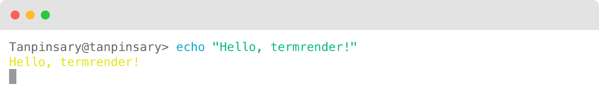
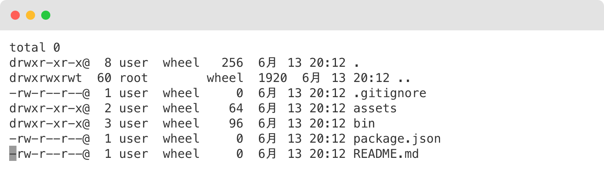
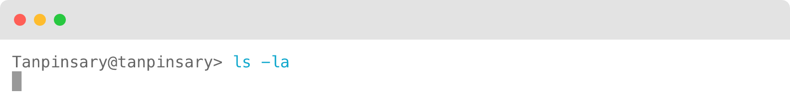

# termrender

Terminal screenshots that **replicate your real terminal** — your shell prompt, your iTerm2 colors and font, and the program's true colored output. Dark or light mode follows your system automatically.



Most terminal-to-image tools render text you hand them, with a generic theme and no prompt. termrender instead *runs the command in a real PTY* and *asks your own shell to render its prompt*, so the screenshot looks like what you'd actually see in your terminal:

```bash
termrender exec --theme auto -o demo.png -- git status -sb
```

…produces a PNG with your real prompt above the command, the command's genuine colors below it (programs detect the PTY and colorize), and your live iTerm2 palette and font around it.

Built on [termless](https://github.com/beorn/termless) for headless terminal emulation and PNG rendering.

## Install

Requires [Bun](https://bun.sh).

```bash
bun install
bun link        # registers the global `termrender` command (~/.bun/bin)
```

## Usage

### `exec` — run a command and screenshot it (highest fidelity)

```bash
termrender exec --theme auto -o ls.png \
  --window-bar rings -- eza -la

# Pin the prompt style and working directory
termrender exec --prompt fish --cwd ~/some/repo -o git.png -- git log --oneline -5
```

| Option | Default | Description |
| --- | --- | --- |
| `--prompt <mode>` | `auto` | Prompt source: `auto`, `fish`, `zsh`, `none`. `auto` resolves the terminal's real shell: iTerm2 profile command → login shell (`dscl`) → `$SHELL` |
| `--cwd <dir>` | cwd | Working dir for the command and the prompt's path/git segments |
| `--timeout <ms>` | 30000 | Max wait for the command to exit |
| `--no-auto-rows` | — | Keep full terminal height instead of trimming empty rows |
| `--no-trailing-prompt` | — | Don't repeat the prompt after the command exits |

Commands must exit on their own — for servers, watch modes, and TUIs, record a `.cast` with asciinema and use `render`.

### `render` — render a .cast recording or piped ANSI text

```bash
termrender render recording.cast -o screenshot.png   # cols/rows from the cast header

echo -e "\e[32mgreen\e[0m" | termrender render -o out.png
```

### Common options

`-o/--output` (`.png`), `--theme <path|auto>`, `--theme-type`, `--profile <name>`, `--cols/--rows`, `--font-family`, `--font-size` (cell geometry scales with it), `--padding` (default 12), `--border-radius` (default 8), `--window-bar none|rings|colorful`, `--margin`, `--margin-fill`.

## Theme sources

| Source | What you get |
| --- | --- |
| *(default, no `--theme`)* | **System theme** — dark or light mode automatically follows your macOS appearance |
| `--theme auto` | Your **live iTerm2 profile**: 16-color palette, fg/bg/cursor, profile font + size. Reads the preferences plist directly (macOS) — no export step |
| `.itermcolors` file | Full exported iTerm2 color scheme |

## Features

### 🐟 Fish syntax highlighting

termrender uses fish shell's token-level algorithm to color commands, options, pipes, and redirections exactly as fish would:

| Token | Color | Example |
|---|---|---|
| Command | cyan | `git`, `echo` |
| Option | cyan | `--oneline`, `-la` |
| Pipe/operator | magenta | `\|`, `&&` |
| Redirection | bold cyan | `>`, `>>` |


### 🎨 System-aware themes

Without any `--theme` flag, termrender automatically picks dark or light based on your macOS system appearance. Here it shows a directory listing with your live iTerm2 palette:



### 🪟 Window bar styles

Choose `rings` (macOS traffic lights), `colorful` (solid dots), or `none`:



## MCP server

`bin/termrender-mcp.ts` exposes termrender to agents as MCP tools — `render_command` and `render_text` — with the rendered PNG returned inline as an image content block, so the agent sees the result immediately.

```bash
claude mcp add --scope user termrender -- bun run /path/to/termrender/bin/termrender-mcp.ts
```

## How it works

- **Real output**: `exec` spawns the command in a PTY (termless `Terminal.spawn`, Bun's native terminal support), so programs emit the same colors they would interactively.
- **Real prompt**: the prompt is rendered by the actual shell — `fish -i -c fish_prompt` (interactive flag required, or fish skips its color variables), or `zsh -ic 'print -rP "$PROMPT"'` — with the right `--cwd`, so path and git segments are live.
- **Real theme**: `--theme auto` extracts the default profile from `com.googlecode.iterm2.plist` key-by-key via `plutil -extract` (the plist contains binary blobs that break whole-file conversion). Supports both sRGB and Display P3 color spaces.
- **Auto-sized images**: `exec` captures on a tall screen, counts used rows, and re-feeds the captured bytes into a content-sized terminal.
- **System theme**: `defaults read -g AppleInterfaceStyle` tells us whether macOS is in Dark or Light mode; the corresponding built-in theme is used automatically.

## Known limitations

- Profile fonts are matched by PostScript name; if the rasterizer can't resolve it, rendering falls back to the bundled monospace stack (layout is unaffected).
- CJK wide characters render with visible gaps between cells.
- `--theme auto` and prompt detection are macOS-centric (iTerm2 plist, `dscl`).

## License

MIT
